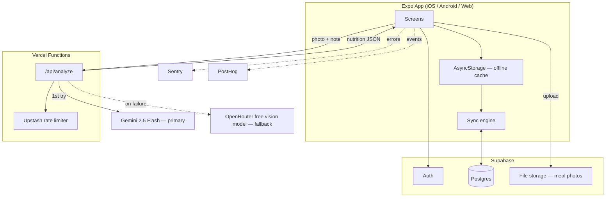

# CalSnap Production Plan (v2)

A path from the current local-only prototype to a fully-fledged, real-user-ready app — crazy-good visual design, real architecture, a database, and auth — built entirely on free-tier services that I can provision and operate directly from the CLI, with your login only.

**What changed since v1:** every service in the stack turns out to have an official CLI, so nothing needed to be compromised. Added a researched fallback AI provider (OpenRouter) alongside Gemini. The design section went from "tasteful" to actually crazy — every interactive element gets a spec.

**What changed in v3:** locked in a distribution decision — web first.

---

## 0. Distribution strategy

**Primary target: the web app**, already live on Vercel (`calsnap-chi.vercel.app`) and installable today via Safari → Add to Home Screen (the PWA manifest is already in place). This means the web build is the *real* product surface, not a demo — every backend and security fix (the Gemini key exposure especially) is now urgent, not "eventually," because the web app is genuinely the thing real users would touch first.

**Testing target during development: Expo Go.** Free, no Apple account beyond a normal one, no build step — `npx expo start`, scan the QR code, the real native app runs on your iPhone with full camera/haptics. This is how we verify native behavior without touching TestFlight or the $99/yr Apple Developer Program, which stays out of scope until there's a reason to pay for it (outside testers, App Store release).

**What this reorders in the roadmap below:** Phase 1 (the security fixes) matters immediately since the web app is the live product now. Native-specific polish (the EAS build pipeline, App Store submission in Phase 5) moves to "later, deliberately" rather than "next" — it's not blocked, it's just not where the near-term effort goes.

---

## 1. The free-tier stack — and how I operate it

Every one of these has an official CLI. You create the account (usually a 30-second email/GitHub signup) and run one login command per service; from that point on I provision, configure, and monitor entirely from the terminal — no dashboard-clicking required from you.

| Need | Pick | Free tier limit | CLI I use | What you do once |
|---|---|---|---|---|
| Database + Auth + File storage | **Supabase** | 500MB Postgres, 50k MAU, 1GB storage, 5GB bandwidth | `supabase` (`npm i -g supabase`) | Sign up, run `supabase login` |
| AI proxy (hides the key) | **Vercel Functions** | 100GB-hrs compute/month | `vercel` (already installed & linked) | Nothing — already set up |
| Rate limiting | **Upstash Redis** | 10,000 commands/day | `upstash` CLI | Sign up, run `upstash login` |
| Crash/error monitoring | **Sentry** | 5,000 errors/month | `@sentry/cli` (`npm i -g @sentry/cli`) | Sign up, run `sentry-cli login` |
| Product analytics | **PostHog** | 1M events/month | `@posthog/cli` (`npm i -g @posthog/cli`) | Sign up, grab a personal API key |
| Native builds & store submission | **EAS Build/Submit** | Free builds/month (enough for weekly releases at this stage) | `eas-cli` (`npm i -g eas-cli`) | Sign up, run `eas login` |
| CI (lint/typecheck/test) | **GitHub Actions** | 2,000 min/month private, unlimited public | `gh` (already installed) | Nothing — already set up |
| Icons | **Phosphor Icons / Lucide** | Free, open-source, MIT | n/a — npm package, not a service | Nothing |

**The one thing without a CLI:** Apple/Google OAuth provider setup for Supabase Auth (registering the app in the Apple/Google developer consoles) is a one-time dashboard step on *their* side, not Supabase's — no way around that regardless of stack choice. Everything else here is fully CLI-driven.

**The only maintenance item:** Supabase's free Postgres pauses after 7 days with no API traffic. A GitHub Actions cron hitting a health-check endpoint daily prevents this, for free, and I'll set it up in Phase 1.

---

## 2. AI provider: Gemini as primary, OpenRouter as a free fallback

You're already on Gemini 2.5 Flash, and it stays primary — its free tier (1,500 requests/day) is the most generous vision-capable free tier available right now, and switching providers would mean re-tuning the prompt for no real gain.

What's worth adding is a **fallback**, so a Gemini outage or a day where the free quota is briefly exhausted doesn't just break meal logging for everyone:

- **OpenRouter** gives access to several genuinely free, vision-capable models under one API key with no credit card required — e.g. Google's Gemma vision models and NVIDIA's Nemotron Nano VL, at roughly 20 requests/minute and 200/day per the free tier as of this research. That's too limited to be primary, but it's a solid safety net.
- The proxy function tries Gemini first; on a 5xx/timeout, it retries once against the OpenRouter fallback model before surfacing an error to the user.
- **Caveat, stated plainly:** OpenRouter's specific free-model lineup rotates — models get added, deprecated, or rate-limited differently over time. The proxy should read the fallback model name from an environment variable, not hardcode it, so swapping the fallback later is a config change, not a code change.

---

## 3. System architecture



**The key architectural shift from today:** the app currently talks to Gemini directly and has no server of its own. In this plan it talks to *your* Vercel function, which is the only thing that ever sees either AI provider's key — and the phone's local storage becomes a cache in front of Supabase, not the permanent record.

---

## 4. Database schema (Supabase / Postgres)

```sql
-- Supabase's built-in auth.users table handles accounts.
-- Everything below is app-specific.

create table profiles (
  id uuid primary key references auth.users(id) on delete cascade,
  display_name text not null default 'Sorcerer',
  calorie_goal int not null default 2000,
  protein_goal int not null default 150,
  install_date timestamptz not null default now(),
  created_at timestamptz not null default now()
);

create table meals (
  id uuid primary key default gen_random_uuid(),
  user_id uuid not null references auth.users(id) on delete cascade,
  meal_type text not null check (meal_type in ('breakfast','lunch','dinner','snack')),
  photo_path text,              -- Supabase Storage object path, not a raw file:// URI
  user_note text default '',
  food_name text not null,
  description text default '',
  calories int not null check (calories >= 0),
  protein int not null check (protein >= 0),
  carbs int not null check (carbs >= 0),
  fat int not null check (fat >= 0),
  confidence text not null check (confidence in ('low','medium','high')),
  ai_provider text not null default 'gemini' check (ai_provider in ('gemini','openrouter')),
  logged_at timestamptz not null default now(),
  created_at timestamptz not null default now()
);

create index meals_user_date_idx on meals (user_id, logged_at desc);

-- Row Level Security: a user can only ever touch their own rows.
alter table profiles enable row level security;
alter table meals enable row level security;

create policy "own profile" on profiles
  for all using (auth.uid() = id);

create policy "own meals" on meals
  for all using (auth.uid() = user_id);
```

Two things this fixes versus today's `AsyncStorage`-only design:
- **Bounded, indexed queries** instead of one growing JSON blob per day loaded wholesale.
- **Server-enforced validation** (`check` constraints) as a second line of defense behind the client-side checks in `parseResponse`, so a malformed AI response or a tampered client request can't write garbage into the database. The `ai_provider` column also means you can see in the data itself how often the fallback is firing.

---

## 5. Auth

**Provider:** Supabase Auth, configured with:
- Email/password (baseline, free, no setup beyond enabling it — CLI: `supabase` migrations manage the schema side)
- Sign in with Apple (**required** by App Store guideline 4.8 if you offer any other third-party login on iOS — needs an Apple Developer account you'll need anyway for distribution)
- Sign in with Google (broadens reach on Android/web)

**Flow:**
1. Onboarding screen gets a "Continue with Apple / Google / Email" step before the existing goal-setting steps — the goals a user sets already belong to *their* account, not the device.
2. On first sign-in, a Postgres trigger on `auth.users` insert creates the `profiles` row automatically — no client code, no race condition where a user exists without a profile.
3. Session persisted via `@supabase/supabase-js` with an AsyncStorage adapter — same library already handling local storage today, so this is additive, not a rewrite.
4. Account deletion (App Store requirement once accounts exist) — one button in Settings calling a Supabase Edge Function that deletes the auth user; `on delete cascade` handles the data.

---

## 6. Crazy design — every component gets a spec

The brief was: not tasteful, not restrained — **crazy**. Every button, switch, and card should look and feel like it belongs in the world the app already gestures at (the "cursed energy / sorcerer" theme in the copy), executed with actual craft instead of a purple gradient slapped on stock components. Here's what that means piece by piece, all buildable with what's already in the dependency tree (`@shopify/react-native-skia`, `react-native-reanimated`, `expo-linear-gradient`, `expo-haptics`) plus free additions.

**The FAB becomes a "Domain Expansion" trigger.** Not a static + in a gradient circle — a Skia-rendered glyph that idles with a slow rotating energy-ring shader, snaps into a tighter spin with a radial flash and a heavy haptic on press, and leaves a brief particle trail using the existing `ParticleBackground` particle system, redirected to emit from the FAB's position instead of floating ambiently.

**Toggle switches are custom-built, not the OS default.** A sliding "seal" that snaps between states with a spring (`withSpring`, already available via Reanimated) overshoot, a soft glow that travels with the thumb, and a distinct haptic tick (`Haptics.selectionAsync`) exactly at the snap point — not on press-down.

**Buttons have real pressed-state physics.** Scale down with spring on press-in, a light sweep animation across the gradient on release, and a colored glow (`shadowColor` + `shadowRadius` pulse) that intensifies while held. The primary "Activate Analysis Technique" button becomes the flagship: gradient border that visibly animates around the edge (Skia sweep gradient) while idle, not just a static border color.

**The calorie ring is a shader, not a static SVG arc.** Skia `Canvas` with a sweep gradient stroke, a soft outer glow layer, and the fill *animates in* with an eased count-up on both the number and the arc simultaneously when a meal is added — currently `ProgressRing` likely renders statically; this makes the number landing feel like an event.

**Meal cards get a "capture" reveal, not a fade-in.** When a meal is saved, the card materializes into the list with a short scale+glow flash in the meal-type's theme color (breakfast=warm, dinner=cool), riffing on the existing `SlashReveal` component's name — it sounds like it was built for exactly this and may already be half-built for it.

**Streak milestones get a full-screen moment.** Hitting 7/30/100-day streaks triggers a brief full-screen takeover: screen-flash, an energy-burst particle explosion from the streak number, a heavy haptic pattern, and a large kinetic-type number animation — this is the single highest-impact "crazy" moment because it's rare enough to feel earned instead of annoying.

**Tab bar with a liquid indicator.** Instead of a static highlight behind the active tab, an indicator that *morphs* its shape as it slides between tabs (a Skia blob using a simple metaball-style blend, or a Reanimated layout animation with an elongate-then-settle spring) rather than a rectangle that just translates.

**Typography gets real weight contrast.** Big numbers (calorie totals, streak count) in a heavier, tighter-tracked treatment than body text, with `fontVariant: ['tabular-nums']` already used in places — extend that discipline everywhere digits appear so numbers don't visually jitter as they change.

**All of this respects `prefers-reduced-motion` / the OS reduce-motion setting** — crazy is the default, not the only mode; anyone with motion sensitivity gets the same information with the animation intensity dialed down, not the feature removed.

**Icons:** Phosphor's "duotone" style (two-tone fill, free, MIT) fits this theme better than a flat outline set — it already has built-in visual weight that flat icon sets don't.

---

## 7. Code architecture

**Move from flat folders to feature folders.** Today: `app/`, `components/`, `store/`, `services/`, `utils/` — each holding every feature's files mixed together. Restructure to:

```
features/
  meals/        (capture, analyze, log — screens, hooks, api)
  insights/     (streaks, charts)
  auth/         (sign-in, onboarding)
  settings/     (goals, account)
shared/
  components/   (Button, Switch, Card, ProgressRing — the design system)
  hooks/
  lib/          (supabase client, sentry init, posthog init)
```

This matters more once there's a backend: each feature's data-fetching, caching, and UI live together instead of being split across four top-level folders that all grow forever.

**Adopt TanStack Query (React Query) for server state.** Free, open-source, standard pairing with Supabase in the Expo ecosystem. Replaces the hand-written async/await + `set()` calls in `useMealStore` with built-in caching, retry, and background refetch — and gives optimistic updates for free, so adding a meal feels instant even while it's syncing to Postgres.

**Keep Zustand for client-only state** (active tab, in-progress form state) — good tool for that, just not for data that now lives on a server.

**Add Zod for runtime validation** at every boundary that currently only does manual `typeof` checks: the AI response parser (now handling two possible providers' response shapes), and any payload going to/from Supabase.

**Repository layer for meals**, so screens never call Supabase or AsyncStorage directly:

```
shared/lib/mealsRepository.ts
  getTodayLog()      → cache-first, syncs in background
  addMeal(meal)       → optimistic local write, queued sync to Supabase
  removeMeal(id)      → same pattern
```

This is what makes offline-first actually work: the UI always reads from the local cache instantly, and the repository is the only place that knows a network call is involved.

---

## 8. Testing & CI

- **Unit tests (Vitest):** the AI response parser (both provider shapes), macro/total aggregation, date helpers, and the sync engine's conflict resolution — the places where a silent bug would corrupt a user's data without anyone noticing.
- **E2E (Maestro — free, open-source, YAML-based, built for Expo):** sign in → take/pick photo → analyze → save → see it on the dashboard.
- **GitHub Actions:** typecheck + lint + unit tests on every PR; a nightly cron pings the Supabase health endpoint so the free project never auto-pauses.

---

## 9. Security & privacy checklist

- [ ] Both AI provider keys live only in the Vercel Function's environment variables — never in an `EXPO_PUBLIC_*` var
- [ ] Upstash rate limit on `/api/analyze` (e.g. 20 requests/user/day) to protect the shared free quotas on both providers
- [ ] Row Level Security enabled on every Supabase table, tested with a second test account to confirm cross-user isolation
- [ ] Signed, time-limited URLs for meal photo storage reads (not public buckets)
- [ ] Account deletion flow that actually removes the Supabase auth user and cascades to their data
- [ ] A real privacy policy and terms page (a static route on the existing Vercel deployment, free) — required for App Store submission the moment the app collects an email address

---

## 10. Roadmap

| Phase | Focus | Key deliverables |
|---|---|---|
| **1 — Foundation** | Stop the bleeding | AI proxy (Gemini + OpenRouter fallback) behind Vercel Function + Upstash rate limit · fix `bundleIdentifier` · Sentry wired in |
| **2 — Backend** | Real accounts | Supabase project + schema + RLS · Auth (email + Apple + Google) · repository layer replacing direct AsyncStorage calls |
| **3 — Sync** | Offline-first, for real | TanStack Query + sync engine · photo upload to Supabase Storage · migrate existing local data on first login |
| **4 — Crazy design pass** | The fun part | Custom Button/Switch/Card component library with real press physics · Skia shader progress ring · liquid tab bar indicator · streak-milestone full-screen moment · Phosphor duotone icons |
| **5 — Ship-ready** | Store submission | Account deletion flow · privacy policy/terms · Maestro E2E · EAS production build · App Store + Play Store submission |

Phases 1–2 gate everything else and match the two critical items from the earlier audit. Phase 4 is where "crazy good" actually happens, and it's independent enough from Phase 3 that I can start prototyping specific components (the FAB shader, the switch) in parallel with the backend work if you'd rather see the design direction before the plumbing is done.

---

### Sources consulted for this revision

- [Supabase CLI reference](https://supabase.com/docs/reference/cli/introduction) / [supabase/cli on GitHub](https://github.com/supabase/cli)
- [Announcing Upstash CLI](https://upstash.com/blog/upstash-cli) / [upstash/cli on GitHub](https://github.com/upstash/cli)
- [PostHog CLI docs](https://posthog.com/docs/cli) / [@posthog/cli on npm](https://www.npmjs.com/package/@posthog/cli)
- [Sentry CLI on GitHub](https://github.com/getsentry/sentry-cli) / [@sentry/cli on npm](https://www.npmjs.com/package/@sentry/cli)
- [EAS CLI on GitHub](https://github.com/expo/eas-cli) / [EAS CLI reference](https://docs.expo.dev/eas/cli/)
- [OpenRouter free-models collection](https://openrouter.ai/collections/free-models) / [OpenRouter vision-models collection](https://openrouter.ai/collections/vision-models)
