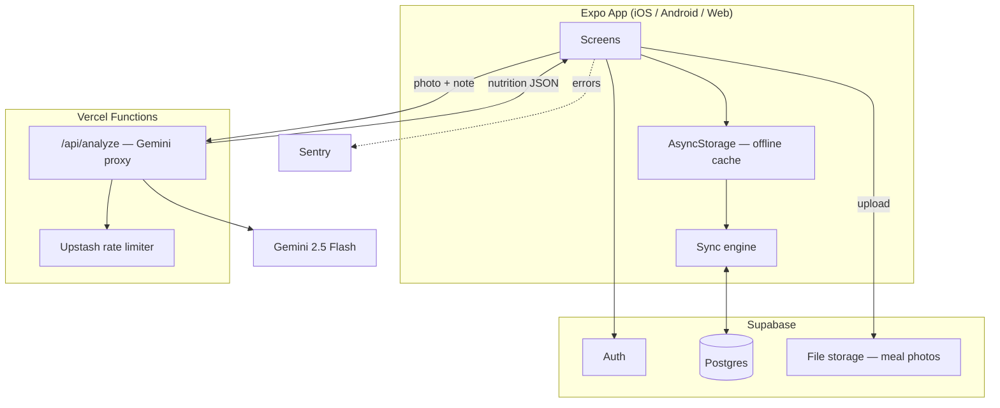

# CalSnap Production Plan

A path from the current local-only prototype to a fully-fledged, real-user-ready app — visual design, architecture, database, and auth — built entirely on free-tier services.

---

## 1. The free-tier stack

The whole point of this plan is that none of it costs money at CalSnap's current scale. Here's what's doing the work and why it was picked over the alternatives.

| Need | Pick | Free tier limit | Why this one |
|---|---|---|---|
| Database + Auth + File storage | **Supabase** | 500MB Postgres, 50k monthly active users, 1GB file storage, 5GB bandwidth | One service instead of three. Row-level security maps cleanly onto "a user can only see their own meals." Has a first-class Expo/React Native SDK. |
| AI proxy (hides the Gemini key) | **Vercel Functions** | 100GB-hrs compute/month on Hobby | Already deploying here — zero new infra to learn. |
| Rate limiting | **Upstash Redis** | 10,000 commands/day | Stops one abusive user from burning through the shared Gemini quota; pairs natively with Vercel Functions. |
| Crash/error monitoring | **Sentry** | 5,000 errors/month | Without this you find out about bugs from angry App Store reviews instead of a dashboard. |
| Product analytics | **PostHog** | 1M events/month | Free self-serve tier, generous enough to see real usage patterns before you'd ever need to pay. |
| Native builds & store submission | **EAS Build/Submit** | Limited free builds/month (enough for weekly releases at this stage) | The standard path for an Expo app; no separate CI needed for native binaries. |
| CI (lint/typecheck/test) | **GitHub Actions** | 2,000 min/month private, unlimited public | Already have GitHub. |
| Icons | **Phosphor Icons / Lucide** | Free, open-source, MIT | Replaces the emoji-as-icon approach with something that actually looks designed. |

**Gemini itself** already has a generous free tier (Gemini 2.5 Flash: 1,500 requests/day at time of writing) — the Upstash rate limit exists to make sure that pool is spent by real users, not scraped by one bad actor who found the endpoint.

**The only thing worth watching:** Supabase's free Postgres project pauses after 7 days of no API activity and needs a manual unpause. A single scheduled GitHub Action hitting a health-check endpoint once a day avoids this entirely, for free.

---

## 2. System architecture



**The key architectural shift from today:** the app currently talks to Gemini directly and has no server of its own. In this plan it talks to *your* Vercel function, which is the only thing that ever sees the Gemini key — and the phone's local storage becomes a cache in front of Supabase, not the permanent record.

---

## 3. Database schema (Supabase / Postgres)

```sql
-- Supabase's built-in auth.users table handles accounts.
-- Everything below is app-specific.

create table profiles (
  id uuid primary key references auth.users(id) on delete cascade,
  display_name text not null default 'Sorcerer',
  calorie_goal int not null default 2000,
  protein_goal int not null default 150,
  install_date timestamptz not null default now(),
  created_at timestamptz not null default now()
);

create table meals (
  id uuid primary key default gen_random_uuid(),
  user_id uuid not null references auth.users(id) on delete cascade,
  meal_type text not null check (meal_type in ('breakfast','lunch','dinner','snack')),
  photo_path text,              -- Supabase Storage object path, not a raw file:// URI
  user_note text default '',
  food_name text not null,
  description text default '',
  calories int not null check (calories >= 0),
  protein int not null check (protein >= 0),
  carbs int not null check (carbs >= 0),
  fat int not null check (fat >= 0),
  confidence text not null check (confidence in ('low','medium','high')),
  logged_at timestamptz not null default now(),
  created_at timestamptz not null default now()
);

create index meals_user_date_idx on meals (user_id, logged_at desc);

-- Row Level Security: a user can only ever touch their own rows.
alter table profiles enable row level security;
alter table meals enable row level security;

create policy "own profile" on profiles
  for all using (auth.uid() = id);

create policy "own meals" on meals
  for all using (auth.uid() = user_id);
```

Two things this fixes versus today's `AsyncStorage`-only design:
- **Bounded, indexed queries** instead of one growing JSON blob per day loaded wholesale.
- **Server-enforced validation** (`check` constraints) as a second line of defense behind the client-side checks in `parseResponse`, so a malformed AI response or a tampered client request can't write garbage into the database.

---

## 4. Auth

**Provider:** Supabase Auth, configured with:
- Email/password (baseline, free, no setup beyond enabling it)
- Sign in with Apple (**required** by App Store guideline 4.8 if you offer any other third-party login on iOS — free to implement, needs an Apple Developer account you'll need anyway for distribution)
- Sign in with Google (free, broadens reach on Android/web)

**Flow:**
1. Onboarding screen gets a "Continue with Apple / Google / Email" step before the existing goal-setting steps — the goals a user sets already belong to *their* account, not the device.
2. On first sign-in, create the `profiles` row (Supabase can do this automatically via a Postgres trigger on `auth.users` insert — no client code needed, no race condition where a user exists without a profile).
3. Session persisted via `@supabase/supabase-js` with an AsyncStorage adapter — same library that's already handling local storage today, so this is additive, not a rewrite.
4. Account deletion (App Store requirement if accounts exist) — one button in Settings that calls a Supabase Edge Function which deletes the auth user; `on delete cascade` on both tables takes care of the data.

---

## 5. Making it look crazy good

The current dark/purple "cursed energy" theme is a real point of view, not generic template design — the plan below is to *execute* that point of view properly, not replace it.

**Design system, not per-screen styling.** Right now colors, spacing, and type sizes are defined once in `constants/theme.ts` but every screen hand-rolls its own `StyleSheet`. The fix is a small shared component library — `Button`, `Card`, `Input`, `Sheet`, `Badge` — built once against the existing tokens, so every screen composes from the same 6–8 primitives instead of redefining a card's border radius five times with slightly different values.

**Replace emoji-as-icon with a real icon set.** Phosphor or Lucide (both free, MIT, tree-shakeable, work in Expo out of the box) — same weight and grid across every icon, filled/outline variants for selected states, and they scale and recolor properly instead of being an emoji glyph at the mercy of the OS font.

**Motion with intent, not just fade-ins.** The app already uses Reanimated well (the FAB pulse, the particle canvas). The upgrade is a few *orchestrated* moments instead of scattered entrance animations: a shared-element transition from the meal photo thumbnail into the full add-meal screen, a satisfying "count-up" number animation on the calorie ring when a meal is added, and a confetti/haptic combo the first time a user hits a streak milestone. Two or three of these land harder than fifteen small fades.

**Empty and loading states as real design surfaces.** Today a loading state is a spinner and an empty list is a line of text. Each of the four tabs gets a purpose-built illustration or animated state for its empty case — this is often the highest-leverage design work in an app because new users see these screens *first*, before they have any data.

**Light mode.** The app is dark-only right now (`userInterfaceStyle: "dark"` in `app.json`). Supporting the system's light/dark preference — same accent colors, inverted neutrals — roughly doubles the audience that will find the default state comfortable, and the token system in `theme.ts` already makes this mechanical rather than a redesign.

**Accessibility as part of "good," not separate from it.** Dynamic type support (respecting the OS text-size setting), minimum contrast ratios on the macro colors against their backgrounds, and VoiceOver/TalkBack labels on icon-only buttons (the settings gear, the FAB). None of this is visible when it's done right, which is exactly the point.

---

## 6. Code architecture

**Move from flat folders to feature folders.** Today: `app/`, `components/`, `store/`, `services/`, `utils/` — each holding every feature's files mixed together. Restructure to:

```
features/
  meals/        (capture, analyze, log — screens, hooks, api)
  insights/     (streaks, charts)
  auth/         (sign-in, onboarding)
  settings/     (goals, account)
shared/
  components/   (Button, Card, Input — the design system)
  hooks/
  lib/          (supabase client, sentry init)
```

This matters more once there's a backend: each feature's data-fetching, caching, and UI live together instead of being split across four top-level folders that all grow forever.

**Adopt TanStack Query (React Query) for server state.** Free, open-source, and it's the standard pairing with Supabase in the Expo ecosystem. It replaces the hand-written async/await + `set()` calls in `useMealStore` with built-in caching, retry, and background refetch — and gives you optimistic updates for free, so adding a meal feels instant even while it's syncing to Postgres.

**Keep Zustand for client-only state** (which tab is active, in-progress form state) — it's a good tool for that, just not for data that now lives on a server.

**Add Zod for runtime validation** at every boundary that currently only does manual `typeof` checks: the Gemini response parser, and any payload going to/from Supabase. Same intent as today's checks, but declarative and reusable instead of hand-written per field.

**Repository layer for meals**, so screens never call Supabase or AsyncStorage directly:

```
shared/lib/mealsRepository.ts
  getTodayLog()      → cache-first, syncs in background
  addMeal(meal)       → optimistic local write, queued sync to Supabase
  removeMeal(id)      → same pattern
```

This is what makes offline-first actually work: the UI always reads from the local cache instantly, and the repository is the only place that knows a network call is involved.

---

## 7. Testing & CI

- **Unit tests (Vitest):** the Gemini response parser, macro/total aggregation, date helpers, and the sync engine's conflict resolution — the four places where a silent bug would corrupt a user's data without anyone noticing.
- **E2E (Maestro — free, open-source, YAML-based, built for Expo):** one flow — sign in → take/pick photo → analyze → save → see it on the dashboard. Catches the "it compiles but the button doesn't actually work" class of bug that unit tests miss.
- **GitHub Actions:** typecheck + lint + unit tests on every PR; a nightly job pings the Supabase health endpoint so the free project never auto-pauses.

---

## 8. Security & privacy checklist

- [ ] Gemini key lives only in the Vercel Function's environment variables — never in an `EXPO_PUBLIC_*` var
- [ ] Upstash rate limit on `/api/analyze` (e.g. 20 requests/user/day) to protect the shared Gemini quota
- [ ] Row Level Security enabled on every Supabase table, tested with a second test account to confirm cross-user isolation
- [ ] Signed, time-limited URLs for meal photo storage reads (not public buckets)
- [ ] Account deletion flow that actually removes the Supabase auth user and cascades to their data (App Store requirement once accounts exist)
- [ ] A real privacy policy and terms page (a static route on the existing Vercel deployment costs nothing) — required for App Store submission the moment the app collects an email address

---

## 9. Roadmap

| Phase | Focus | Key deliverables |
|---|---|---|
| **1 — Foundation** | Stop the bleeding | Gemini proxy behind Vercel Function + Upstash rate limit · fix `bundleIdentifier` · Sentry wired in |
| **2 — Backend** | Real accounts | Supabase project + schema + RLS · Auth (email + Apple + Google) · repository layer replacing direct AsyncStorage calls |
| **3 — Sync** | Offline-first, for real | TanStack Query + sync engine · photo upload to Supabase Storage · migrate existing local data into the new schema on first login |
| **4 — Design pass** | The "crazy good" part | Shared component library · icon set swap · light mode · empty-state illustrations · 2–3 orchestrated motion moments |
| **5 — Ship-ready** | Store submission | Account deletion flow · privacy policy/terms · Maestro E2E on the core flow · EAS production build · App Store + Play Store submission |

Phases 1–2 are the ones that gate everything else — they're also the two items already flagged as critical in the earlier audit. Everything from Phase 4 onward is genuinely additive and can be reordered or parallelized once the backend is real.
